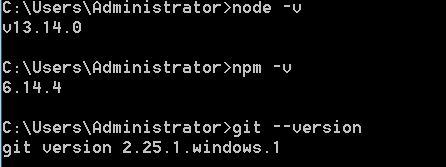
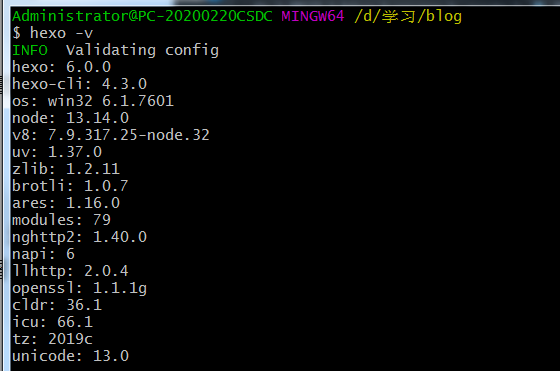

既然都用github搭建博客，怎么也得要记录下采坑过程~

所以 ,,, GO~

<!--more-->

# 一、环境搭建

Hexo 基于 Node.js，搭建过程中还需要使用 npm（Node.js 已带） 和 git，因此先搭建本地操作环境，安装 Node.js 和 Git。

* Node.js：https://nodejs.org/zh-cn
* Git：https://git-scm.com/downloads

下载 Node.js 和 Git 程序并安装，一路点 “下一步” 按默认配置完成安装。

安装完成后，Win+R 输入 cmd 并打开，依次输入 node -v、npm -v 和 git --version 并回车，如下图出现程序版本号即可。

>

## 安装Hexo
接下来就需要安装 Hexo 了，这是一个博客框架，Hexo 官方还提供了一个命令行工具，用于快速创建项目、页面、编译、部署 Hexo 博客，所以在这之前我们需要先安装 Hexo 的命令行工具。

命令如下：
> npm install -g hexo-cli

安装完毕之后，确保环境变量配置好，能正常使用 hexo -v 命令。
>

# 二、初始化项目
接下来我们使用 Hexo 的命令行创建一个项目，并将其在本地跑起来，整体跑通看看。

首先使用如下命令创建项目：

> hexo init {name}

这里的 name 就是项目名，我这里要创建 NightTeam 的博客，我就把项目取名为 nightteam 了，用了纯小写，命令如下：

> hexo init blog

这样 blog 文件夹下就会出现 Hexo 的初始化文件，包括 themes、scaffolds、source 等文件夹，这些内容暂且先不用管是做什么的，我们先知道有什么，然后一步步走下去看看都发生了什么变化。

接下来我们首先进入新生成的文件夹里面，然后调用 Hexo 的 generate 命令，将 Hexo 编译生成 HTML 代码，命令如下：

> hexo generate

可以看到输出结果里面包含了 js、css、font 等内容，并发现他们都处在了项目根目录下的 public 文件夹下面了。

然后我们利用 Hexo 提供的 serve 命令把博客在本地运行起来，命令如下：

> hexo serve

运行之后命令行输出如下：

> INFO  Start processing  
> INFO  Hexois running at http://localhost:4000 . Press Ctrl+C to stop
>
它告诉我们在本地 4000 端口上就可以查看博客站点了


## 三、 创建 Github Pages 仓库
GitHub 主页右上角加号 -> New repository：

> Repository name 中输入 用户名.github.io  
> 勾选 “Initialize this repository with a README”  
> Description 选填
填好后点击 Create repository 创建。


创建后默认自动启用 HTTPS，博客地址为：https://用户名.github.io

## 四、部署 Hexo 到 GitHub Pages
本地博客测试成功后，就是上传到 GitHub 进行部署，使其能够在网络上访问。

首先安装 hexo-deployer-git：

> npm install hexo-deployer-git --save

然后修改 _config.yml 文件末尾的 Deployment 部分，修改成如下：

> deploy:  
>   type: git  
>   repository: git@github.com:用户名/用户名.github.io.git  
>   branch: master

完成后运行 hexo d 将网站上传部署到 GitHub Pages。

完成！这时访问我们的 GitHub 域名 https://用户名.github.io 就可以看到 Hexo 网站了。

# 五、初次尝试
## 5.1 发布文章
进入博客所在目录，右键打开 Git Bash Here，创建博文：

> hexo new "My New Post"

然后 source 文件夹中会出现一个 My New Post.md 文件，就可以使用 Markdown 编辑器在该文件中撰写文章了。

写完后运行下面代码将文章渲染并部署到 GitHub Pages 上完成发布。以后每次发布文章都是这两条命令。

> hexo g   # 生成页面  
> hexo d   # 部署发布

---
也可以不使用命令自己创建 .md 文件，只需在文件开头手动加入如下格式 Front-matter 即可，写完后运行 hexo g 和 hexo d 发布。

```
---
title: Hello World # 标题
date: 2019/3/26 hh:mm:ss # 时间
categories: # 分类
- Diary
tags: # 标签
- PS3
- Games
---

摘要
<!--more-->
正文
```