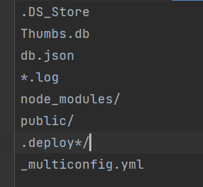

又想要随时随地撸blog，所有又有啥快速的办法呢？

# 一、建立分支hexo
1、在本地D盘下（位置任意）右键Git bash here，执行以下指令，把zgzfine.github.io项目文件克隆到本地：
> git clone git@github.com:zgzfine/zgzfine.github.io.git

2、然后D盘下就会有个zgzfine.github.io的文件夹，里面的文件就是repository上的。  
3、进入zgzfine.github.io，删除文件夹里除了.git的其他所有文件  
4、把你的blog文件夹内的所有文件全部复制到zgzfine.github.io/下  
5、里面应该有个叫.gitignore的文件，没有的话就自己创建一个，里面的内容如下：

6、创建一个叫hexo（或者blog，名字随意）的分支，并切换到这个分支
> git checkout -b hexo

7、添加所有文件到暂存区
> git add --all

8、进行提交
>  git commit -m "init"

9、推送hexo分支的文件到github仓库
>  git push --set-upstream origin hexo

# 二、初始化
1、同理在github上下载源文件
> git clone git@github.com:zgzfine/zgzfine.github.io.git 

2、切换分支
> git checkout -b hexo origin/hexo

3、安装hexo
> npm install -g hexo-cli

在这部有可能安装失败，可以使用以下命令
> npm install hexo --save

4、发布推送
>  hexo d

到此，步骤已经结束，可以愉快的撸起来

