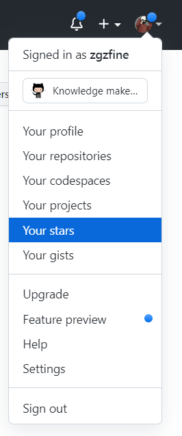
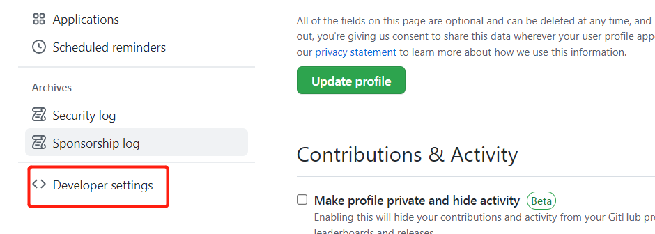
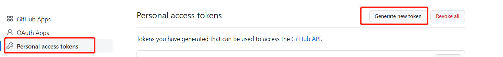
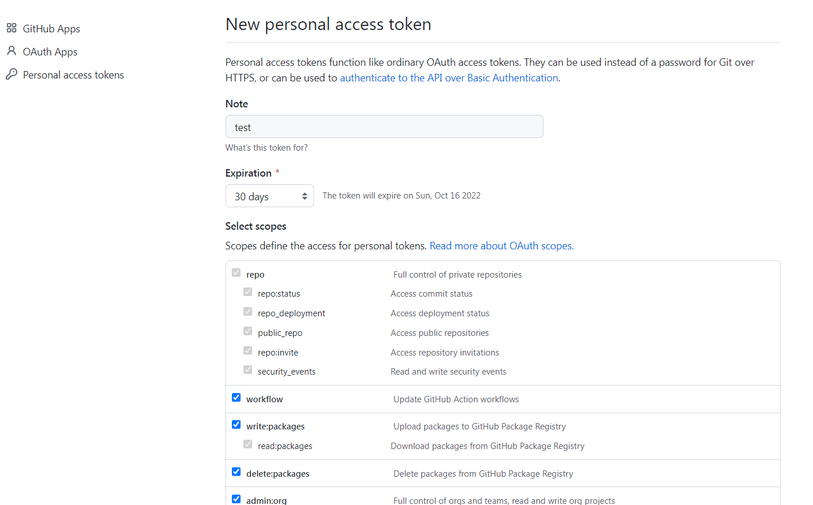

## 问题描述

昨天偶然想往Github上提交一个新项目，在常规的输入Username和Password之后，Github返回了这样一个错误：

> remote: Support for password authentication was removed on August 13, 2021. Please use a personal access token instead.
> remote: Please see https://github.blog/2020-12-15-token-authentication-requirements-for-git-operations/ for more information.

大概意思就是，以前的密码认证从2021年8月13日开始就不能用了，必须使用个人访问令牌（personal access token），也就是把你的密码替换成token。

## 背景
> 官方解释：https://github.blog/2020-12-15-token-authentication-requirements-for-git-operations/

近年来，GitHub 客户受益于 GitHub.com 的多项安全增强功能，例如双重身份验证、登录警报、验证设备、防止使用泄露密码和WebAuthn 支持。这些功能使攻击者更难获取在多个网站上重复使用的密码并使用它来尝试访问您的 GitHub 帐户。尽管有这些改进，但由于历史原因，未启用双因素身份验证的客户仍然能够仅使用其 GitHub 用户名和密码继续对 Git 和 API 操作进行身份验证。

从 2021 年 8 月 13 日开始，我们在对 Git 操作进行身份验证时将不再接受帐户密码，并将要求使用基于令牌的身份验证，例如个人访问令牌（针对开发人员）或 OAuth 或 GitHub 应用程序安装令牌（针对集成商）适用于 GitHub.com 上所有经过身份验证的 Git 操作。您也可以在您喜欢的地方继续使用 SSH 密钥。

与基于密码的身份验证相比，令牌提供了许多安全优势：

* 唯一 —— 令牌特定于 GitHub，可以按使用或按设备生成
* 可撤销 —— 令牌可以随时单独撤销，无需更新未受影响的凭据
* 有限 —— 令牌的范围可以很窄，只允许用例所需的访问权限
* 随机 —— 令牌不受字典类型或暴力尝试的影响，您需要记住或定期输入的更简单的密码可能是

## 问题解决
找到个人Settings页面：

找到Developer settings（我截图的时候这个选项在最下面）

选择个人访问令牌Personal access tokens，然后选中生成令牌Generate new token

设置token的特性，比如：标题，有效期，token权限,并勾选所有

生成令牌Generate token

把token复制下来(token只能查看一次之后就不在展示)

之后提交代码的时候，在之前输入密码的地方输入这个token就可以了。

也可以 把token直接添加远程仓库链接中，这样就可以避免同一个仓库每次提交代码都要输入token了：

> git remote set-url origin https://your_token@github.com/USERNAME/REPO.git

* your_token:换成你自己得到的token  
* USERNAME:是你自己github的用户名  
* REPO:是你的仓库名称  

## 还有点新鲜事儿 
这事儿说新鲜也不新鲜了，就是新创建的repo里面，默认分支已经从master改名成main了。

因为在2020年6月份，受美国大规模的 “Black Lives Matter”运动影响，为了安抚愈演愈烈的民众情绪，GitHub 就宣布将替换掉 master 等术语，以避免联想奴隶制。

而对于为何选择“main”而不是其他替换词汇，Github 方面给出的解释为，main 是他们在平台上看到的最受欢迎的 master 替代品。并且 main 这个词汇很短，可以帮助用户形成良好的肌肉记忆；在很多种语言中翻译起来也都很容易。