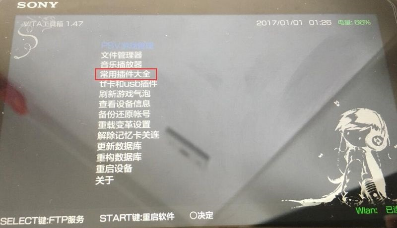

这里主要介绍的是vpk格式和文件夹形式的mai与NND格式游戏安装方法,推荐使用usb上传后使用文件夹格式安装更快。

<!--more-->

游戏的安装方法一般会标注在文件名尾部，如 **[NND]** 表示NND格式，**[mai]** 表示mai格式

准备工作.小V必备的软件：

VitaShell（文件管理器，主要用于usb传输和vpk安装、文件管理等）

项目地址：https://github.com/TheOfficialFloW/VitaShell

下载地址: VitaShell.rar 解压密码: yang2000ling.cn

MaiDumpTool （mai游戏解密提取工具，另外还有安装文件夹格式游戏和补丁、dlc等功能）

项目地址：https://github.com/BeniYukiMai/MaiDumpTool/releases/

下载地址: MaiDumpTool_V233.2zEx.rar 解压密码: yang2000ling.cn

---

方法一 vpk安装、打包方法：
其实vpk格式是一种zip的压缩包，所以可以使用压缩软件直接打开，安装方法也简单,上传到小V后直接用vitashell选择安装就可以了。 下面介绍下vpk游戏格式的文件结构，方便了解游戏是不是vpk格式的结构,是不是错误导致无法安装等问题。 具体就不在做详细说明了，有需要的可以自行百度。

电脑上用压缩软件打开就如上图是这个种结构，就代表是正确的，简单的判断就是根目录下没有红框里面的文件，所以下载来的文件夹格式只要结构正确就可以把所有文件打包zip格式的压缩包，完成后把后缀.zip改成vpk就可以了。 文件没有显示后缀的又不知道哪里改的也请自行百度。

---
方法二 mai格式安装方法：
mai安装需要注意的是文件一定要传到 ux0:/mai 文件夹里，如果没有自行建立。 这个需要你安装了上面mai软件，游戏传到小V后打开mai选择文件夹安装在选游戏就可以安装完成，vitashell现在也支持文件夹格式的安装但是我几乎没用过（有兴趣的朋友可以试试看），所以还是推荐使用mai安装。 vpk格式的也可以转文件夹格式，是要把vpk的文件全部解压出来传到自定文件夹了用mai安装。但需要注意的是这个比vpk的结构多了一层文件夹。

主要多了一个以游戏id为名的文件夹，里面才是之前说的vpk里的文件结构，所以转文件夹格式时要自行建立以游戏id的文件夹，把游戏解压到里面。 上传时要传游戏id名的文件夹到 ux0:/mai 。

mai安装游戏路径说明（游戏id为每个游戏游戏标号 例如：PCSD00085）：

> 游戏本体：ux0:/mai/游戏id

> 游戏补丁：ux0:/mai/游戏id_patch

> DLC：ux0:/mai/游戏id_addc

mai的游戏dlc需要更改游戏加载模式为5

--- 
方法三 NoNpDrm（NND格式）游戏安装方法：
注意：NoNpDrm版本的游戏不能使用mai安装！

把游戏所有文件传到内存卡（ux0）下，具体请查看存放位置说明，然后用VitaShell在ux0上按三角选Refresh LiveArea更新图标（第一项），刷新完成桌面就会有游戏的气泡，或者使用工具箱刷新游戏气泡。

NoNpDrm游戏需要插件支持才能游戏，点击下载NoNpDrm v1.2插件，里面下载和安装方法。

ps：NoNpDrm插件安装和刷新游戏都可以工具箱操作。

NoNpDrm游戏区分很简单，因为是加密的所以在游戏里随便找个图片打开，如果图片无法正常显示就是NoNpDrm格式的游戏。

打开vita工具箱，选择常用插件大全，安装NoNpDrm插件，如果安装过该插件的可以跳过这个步骤。

用数据线把PSV连接到电脑上，接下来在vitashell或者vita工具箱主界面按start键启用USB连接。

把NoNpDrm游戏拷贝到PSV储存卡{或卡托TF卡}的相应目录下：

NoNpDrm游戏文件存放位置：

> 游戏本体传输到ux0:/app下，路径为ux0:/app/游戏编号

> DLC传输到ux0:/addcont下，路径为ux0:/addcont/游戏编号

> 补丁传输到ux0:/patch下，路径为ux0:/patch/游戏编号

如果下载的游戏文件包括（如app、addcont、patch其中一个或几个）这些文件夹的直接用数据线上传到ux0根目录就可以了。

上传完成后用vitashell或使用工具箱刷新出游戏气泡，必须是安装了NoNpDrm插件后才能刷出。