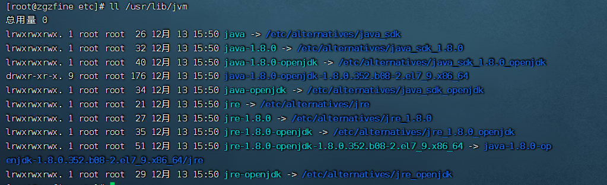

1、查看当前系统是否已经安装JDK
> 查看系统版本  
> [root@localhost ~]# cat /etc/redhat-release   
> CentOS Linux release 7.4.1708 (Core)
>
> jdk的安装情况
> * rpm -qa |grep java
> * rpm -qa |grep jdk
> * rpm -qa |grep gcj
>
> 如果存在就批量卸载
> rpm -qa | grep java | xargs rpm -e --nodeps

<!--more-->

2、使用yum安装1.8版本openJdk
> [root@localhost ~]# yum install java-1.8.0-openjdk* -y

3、安装情况
> [root@zgzfine etc]# java -version  
> openjdk version "1.8.0_352"  
> OpenJDK Runtime Environment (build 1.8.0_352-b08)  
> OpenJDK 64-Bit Server VM (build 25.352-b08, mixed mode)  

4、添加环境变量
* 查看jdk的安装地址

* 通过命令1输出内容，查看jdk的安装地址

* 通过命令2输出内容，拿到jdk的实际地址

* 进入配置文件/etc/profile

* 将环境变量编译生效
> . /etc/profile
> 

5、结果检查
