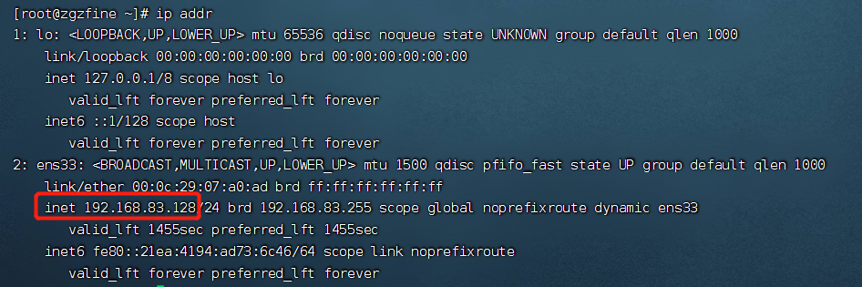
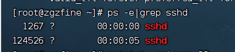

OpenSSH 是 SSH （Secure SHell） 协议的免费开源实现。SSH协议族可以用来进行远程控制， 或在计算机之间传送文件。而实现此功能的传统方式，如telnet(终端仿真协议)、 rcp ftp、
rlogin、rsh都是极为不安全的，并且会使用明文传送密码。OpenSSH提供了服务端后台程序和客户端工具，用来加密远程控制和文件传输过程中的数据，并由此来代替原来的类似服务

<!--more-->

1、检查Centos是否已经安装哦openssh(CentOS系统默认安装了openssh)
> yum list installed | grep openssh-server

2、安装OpenSSH服务
> yum install openssh-server -y

3、配置OpenSSH服务(默认的配置已可以正常工作)

> OpenSSH的主配置文件：/etc/ssh/sshd_config  
> 常见的配置选项：  
> Port=22 设置SSH的端口号是22(默认端口号为22)  
> Protocol 2 启用SSH版本2协议  
> ListenAddress 192.168.0.222 设置服务监听的地址  
> DenyUsers user1 user2 foo 拒绝访问的用户(用空格隔开)  
> AllowUsers root osmond vivek 允许访问的用户(用空格隔开)  
> PermitRootLogin no 禁止root用户登陆  
> PermitEmptyPasswords no 用户登陆需要密码认证  
> PasswordAuthentication yes 启用口令认证方式  

4、重新启动
> service sshd restart

5、查看服务器ip
> ip addr
> 

6、检查sshd服务状态
> ps -e | grep sshd

7、设置开机启动
> systemctl enable sshd.service

8、通过客户端远程访问
ssh username@hostname(hostIP)
如：ssh zgzfine@192.168.83.128