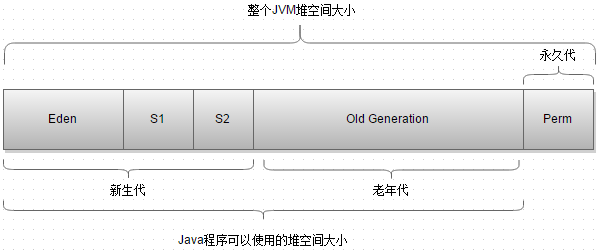
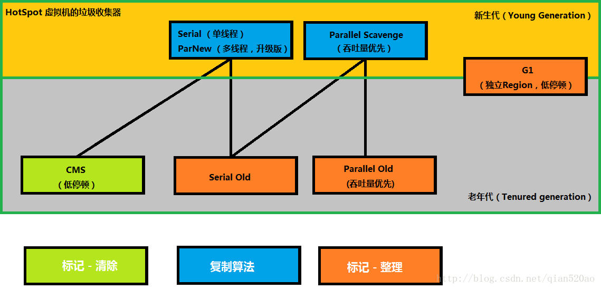
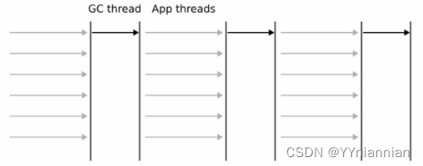
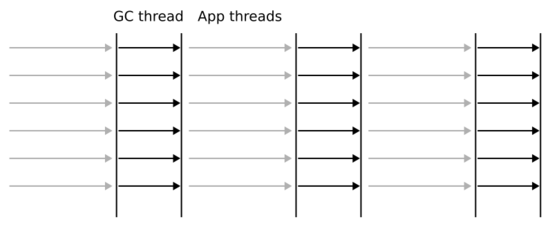
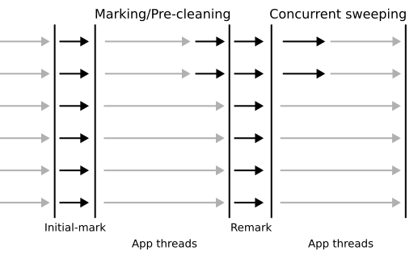
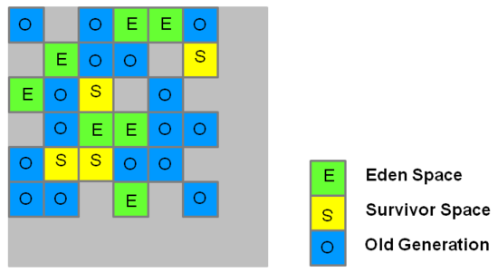

用 C 或 C++ 这样的编程语言写一个应用时，需要编写代码来销毁内存中不再需要的对象。当应用程序扩展得越来越复杂时，未使用对象被忽略释放的可能性就越大。这会导致内存泄露，最终内存耗尽，在某个时刻将没有更多的内存可以分配。结果就是应用程序运行失败并出现 OutOfMemoryError 错误。但在 Java 中， 垃圾收集器Garbage Collection （GC）会在程序执行过程中自动运行，减轻了手动分配内存和可能的内存泄漏的任务。
垃圾收集器并不只有一种，Java 虚拟机（JVM）有七种不同的垃圾收集器，了解每种垃圾收集器的目的和优点是很有用的。

JDK1.8之前的堆内存示意图：

JDK7/8后，HotSpot虚拟机所有收集器及组合（连线），如下图：

<!--more-->
1、Serial 收集器

垃圾收集器的原始实现，使用单线程。当垃圾收集器运行时，会停止应用程序（通常称为“stop the world”事件）。适用于能够承受短暂停顿的应用程序。该垃圾收集器占用内存空间比较小，因此这是嵌入式应用程序的首选垃圾收集器类型。在运行时使用以下命令启用该垃圾收集器：

$ java -XX:+UseSerialGC
2、Parallel 收集器

像 Serial 收集器一样，Parallel 收集器也使用“stop the world”方法。这意味着，当垃圾收集器运行时，应用程序线程会停止。但是不同的是，Parallel 收集器运行时有多个线程执行垃圾收集操作。这种类型的垃圾收集器适用于在多线程和多处理器环境中运行中到大型数据集的应用程序。

这是 JVM 中的默认垃圾收集器，也被称为 吞吐量收集器 。使用该垃圾收集器时可以通过使用各种合适的 JVM 参数进行调优，例如吞吐量、暂停时间、线程数和内存占用。如下：

-XX:ParallelGCThreads=<N>
-XX:MaxGCPauseMillis=<N>
-XX:GCTimeRatio=<N>
-Xmx<N>
Parallel 收集器可以使用该命令显式启用： java -XX:+UseParallelGC 。使用这个命令，指定在新生代中通过多个线程进行垃圾回收，而老年代中的垃圾收集和内存压缩仍使用单个线程完成的。

还有一个版本的的 Parallel 收集器叫做 “Parallel Old GC”，它对新生代和老年代都使用多线程，启用命令如下：

$ java -XX:+UseParallelOldGC
3、Concurrent Mark Sweep（CMS）收集器

Concurrent Mark Sweep（CMS）垃圾收集器与应用程序并行运行。对于新生代和老年代都使用了多线程。在 CMS 垃圾收集器删除无用对象后，不会对存活对象进行内存压缩。该垃圾收集器和应用程序并行运行，会降低应用程序的响应时间，适用于停顿时间较短的应用程序。这个收集器在 Java8 已过时，并在 Java14 中被移除。如果你仍在使用有这个垃圾收集器的 Java 版本，可以使用如下命令启用：

$ java -XX:+UseConcMarkSweepGC
在 CMS 垃圾收集器使用过程中，应用程序将暂停两次。首次暂停发生在标记可直接访问的存活对象时，这个暂停被称为 初始标记 。第二次暂停发生在 CMS 收集器结束时期，来修正在并发标记过程中，应用程序线程在 CMS 垃圾回收完成后更新对象时被遗漏的对象。这就是所谓的 重新标记 。

4、G1 收集器

G1 垃圾收集器旨在替代 GMS。G1 垃圾收集器具备并行、并发以及增量压缩，且暂停时间较短。与 CMS 收集器使用的内存布局不同，G1 收集器将堆内存划分为大小相同的区域，通过多个线程触发全局标记阶段。标记阶段完成后，G1 知道哪个区域可能大部分是空的，并首选该区域作为清除/删除阶段。

在 G1 收集器中，一个对象如果大小超过半个区域容量会被认为是一个“大对象” 。这些对象被放置在老年代中，在一个被称为“humongous region”的区域中。 启用 G1 收集器的命令如下：

$ java -XX:+UseG1GC
5、Epsilon 收集器
该垃圾收集器是在 Java11 中引入的，是一个 no-op （无操作）收集器。它不做任何实际的内存回收，只负责管理内存分配。Epsilon 只在当你知道应用程序的确切内存占用情况并且不需要垃圾回收时使用。启用命令如下：

$ java -XX:+UnlockExperimentalVMOptions -XX:+UseEpsilonGC
6、Shenandoah 收集器
Shenandoah 是在 JDK12 中引入的，是一种 CPU 密集型垃圾收集器。它会进行内存压缩，立即删除无用对象并释放操作系统的空间。所有的这一切与应用程序线程并行发生。启用命令如下：

$ java -XX:+UnlockExperimentalVMOptions -XX:+UseShenandoahGC
7、ZGC 收集器
ZGC 为低延迟需要和大量堆空间使用而设计，允许当垃圾回收器运行时 Java 应用程序继续运行。ZGC 收集器在 JDK11 引入，在 JDK12 改进。在 JDK15，ZGC 和 Shenandoah 都被移出了实验阶段。启用 ZGC 收集器使用如下命令：

$ java -XX:+UnlockExperimentalVMOptions -XX:+UseZGC
灵活的垃圾收集器
Java 为我们提供了灵活的内存管理方式，熟悉不同的可用方法有助于为正在开发或运行的应用程序选择最合适的内存管理方式。
————————————————
版权声明：本文为CSDN博主「YYniannian」的原创文章，遵循CC 4.0 BY-SA版权协议，转载请附上原文出处链接及本声明。
原文链接：https://blog.csdn.net/YYniannian/article/details/125974720