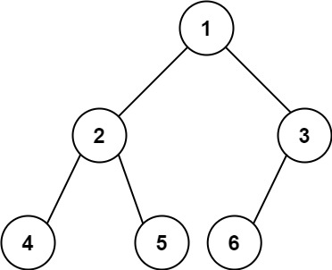

> 给你一棵 完全二叉树 的根节点 root ，求出该树的节点个数。
<!--more-->
> 完全二叉树 的定义如下：在完全二叉树中，除了最底层节点可能没填满外，其余每层节点数都达到最大值，并且最下面一层的节点都集中在该层最左边的若干位置。若最底层为第 h 层，则该层包含 1~2^h个节点。

示例 1：


输入：root = [1,2,3,4,5,6]  
输出：6  

示例 2：  
输入：root = []  
输出：0  

示例 3：
输入：root = [1]  
输出：1  


提示：

树中节点的数目范围是[0, 5 * 104]  
0 <= Node.val <= 5 * 104
题目数据保证输入的树是 完全二叉树  

```
/**
 * 222. 完全二叉树的节点个数
 */
public class LeetCode222 {

    /**
     * 题目里面说到求完全二叉树的节点个数，如果单纯是求二叉树的个数，我们很容易想到 BFS、DFS
     * 但是题目说到是完全二叉树，那么就有完全二叉树的特点
     */
    public int countNodes(TreeNode root) {
        return dfs(root);
    }

    /**
     * 年轻人不讲武德 之 DFS
     */
    public int dfs(TreeNode root) {
        if (root == null) {
            return 0;
        }
        //左子树的节点+右子树的节点+头节点
        return dfs(root.left) + dfs(root.right) + 1;
    }

    /**
     * 简单的 bfs
     */
    public int bfs(TreeNode root) {
        if (root == null) {
            return 0;
        }
        Queue<TreeNode> qe = new LinkedList<>();
        qe.offer(root);
        int num = 0;
        while (!qe.isEmpty()) {
            int size = qe.size();
            while (size-- > 0) {
                num++;
                TreeNode node = qe.poll();
                if (node.left != null) qe.offer(node.left);
                if (node.right != null) qe.offer(node.right);
            }
        }
        return num;
    }

    /**
     * 此题本意 是利用完全二叉树的特性进行
     */
    public int realSource(TreeNode root) {
        if (root == null) {
            return 0;
        }
        int left = getDepth(root.left);
        int rigth = getDepth(root.right);
        if (left == rigth) {//如果相等，那么左子树就是满二叉树，满二叉树 = 2^n-1
            //2^left其实是 （2^left - 1） + 1 ，左子树 + 根结点,同时 2^n = (1<<n)
            return (1 << left) + realSource(root.right);
        } else {//不相等，那么右子树就是满二叉树，这两句话得要好好体会~~~
            return (1 << rigth) + realSource(root.left);
        }
    }

    /**
     * 获取深度就不断的查看左节点
     */
    public int getDepth(TreeNode root) {
        int num = 0;
        while (root != null) {
            root = root.left;
            num++;
        }
        return num;
    }
}

```