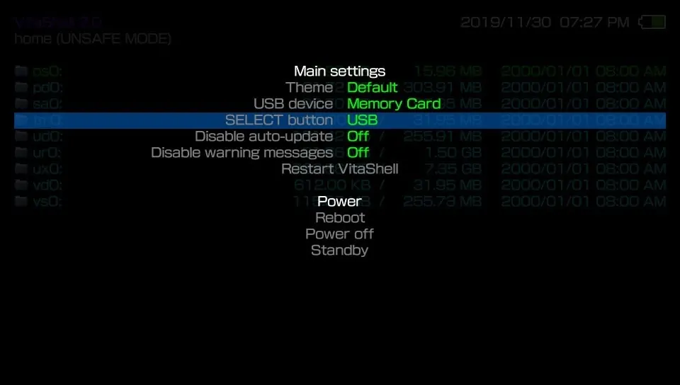

PSV破解后，下载的游戏文件如何传输到PSV呢？如何不取内存卡上传呢？

<!--more-->

本文提供详细方法如下：

1、先确保PSV的设定，HENkaku设置中，

勾选了启用不安全自制软件。

如果不进行本步设置，下面的SELECT操作会提示：
> The feature requires estended permissions.
> Please activate 'Enable unsafe homebrew' first.
 

2、电脑和PSV都接入相同的WiFi无线（PSV如果是飞行模式，请取消飞行模式）
3、PSV启动桌面的VitaShell
4、进入程序后，按PSV右下的START，出现设置界面，核对SELECT button后是否是FTP，如果不是，选中该项，按O键切换为FTP后按X键返回。

之后，再按SELECT，既可呼出FTP服务。屏幕会显示你的FTP的IP和端口。

5、电脑使用FTP客户端
没有安装的，下载并安装
FileZilla客户端-64位.rar
执行安装程序，一路Next，最终安装完成。

6、启动刚装好的Filezilla
主机的输入框，填写第四步显示的IP
然后端口的输入框，填写1337
然后点击快速连接

FTP连接成功后，点击右侧远程站点下的ux0目录，进入PSV的ux0目录

8、本地站点，进入你电脑要上传文件的文件夹，然后右键要上传的文件，选上传即可将文件上传到ux0目录。
如果需要将文件上传到app目录或者其他目录，右侧进入对应目录即可。

9、如果你上传的是vpk的可安装文件，那么上传结束后，PSV按X取消FTP，然后进入ux0目录找到你刚才上传的vpk文件安装即可。大文件安装需要时间会很久，耐心等待安装完毕后，桌面就会出现安装后的程序气泡了。
10、按三角可以调出文件操作菜单，可以执行删除等操作。
相关项目链接:
https://github.com/TheOfficialFloW/VitaShell