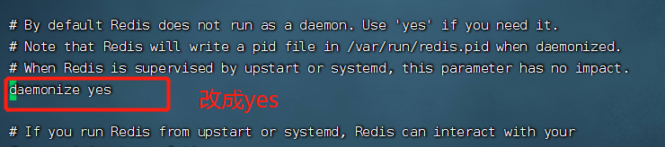
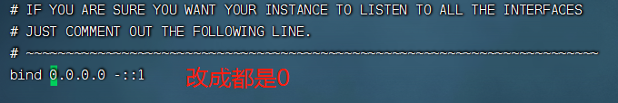
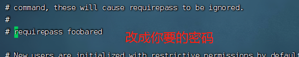

平时用的最多是centos服务器，本案例使用centos7为例子，其他linux服务器雷同
一般用的最多的是以下两种安装方式。。。
<!--more-->

# 使用二进制文件安装(推荐)

1.安装依赖
redis是由C语言开发，因此安装之前必须要确保服务器已经安装了gcc，可以通过如下命令查看机器是否安装：

> gcc -v

如果没有安装则通过以下命令安装：

> yum install -y gcc


2.下载redis安装包并解压
> 下载，我是在root下执行的下载，所以我的下载目录为：/root/redis-6.2.6，这里按照自己的实际情况调整
> wget https://download.redis.io/releases/redis-6.2.6.tar.gz
> #解压
> tar -zxvf redis-6.2.6.tar.gz
>

3.进入解压目录并编译
> #进入解压目录
> cd redis-6.2.6
> #编译
> make

4.指定安装目录并进行安装
> make install PREFIX=/usr/local/redis

5.启动redis服务
5.1 直接启动（不建议使用）
> #进入redis安装目录
> cd /usr/local/redis/bin/
> #启动服务
> ./redis-server

5.2 通过守护进程方式启动
> #第一步：从 redis 的源码目录中复制 redis.conf 到 redis 的安装目录
> cp /root/redis-6.2.6/redis.conf /usr/local/redis/bin/
> #第二步：修改redis.conf配置文件
> cd /usr/local/redis/bin/
> vi redis.conf
> #修改内容如下：
> #daemonize 的值从 no 修改成 yes
> #第三步：启动服务
> ./redis-server redis.conf
> #第四步：查看进程来确定redis是否启动成功，非必须
> ps -ef |grep redis


备注：如果想要设置指定IP连接redis，只需要修改redis.conf文件中bind配置项即可。如果不限IP，将127.0.0.1修改成0.0.0.0即可。


如果想要设置密码


6.设置开机自动启动
切换到/lib/systemd/system/目录，创建redis.service文件。命令如下：
> cd /lib/systemd/system/
> vim redis.service
> 文件内容如下：

```
[Unit]
Description=redis-server
After=network.target

[Service]
Type=forking
# ExecStart需要按照实际情况修改成自己的地址
ExecStart=/usr/local/redis/bin/redis-server /usr/local/redis/bin/redis.conf
PrivateTmp=true

[Install]
WantedBy=multi-user.target
```

设置开启自动启动

```
# 第一步：从 redis 的源码目录中复制 redis.conf 到 redis 的安装目录
cp /root/redis-6.2.6/redis.conf /usr/local/redis/bin/
# 第二步：修改redis.conf配置文件
cd /usr/local/redis/bin/
vi redis.conf
# 修改内容如下：
#daemonize 的值从 no 修改成 yes
# 第三步：启动服务
./redis-server redis.conf
# 第四步：查看进程来确定redis是否启动成功，非必须
ps -ef |grep redis
```

# 使用yum安装

yum 默认安装的是很老的 redis，新版 redis 增加了很多新功能，需要手动指定 yum 源才能安装最新版 redis
首先，卸载旧版本 redis
> $ sudo yum -y remove redis

更新 yum
> $ sudo yum -y update

添加 yum 源
> $ sudo yum -y install http://rpms.remirepo.net/enterprise/remi-release-7.rpm

安装 redis
> $ sudo yum --enablerepo=remi install redis -y

