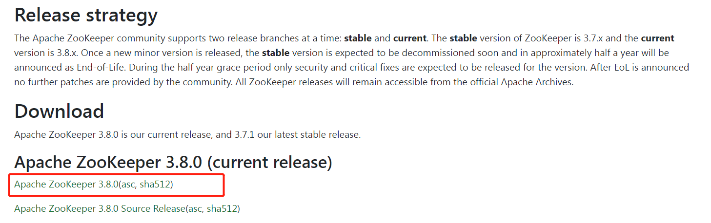
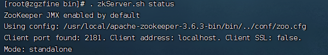
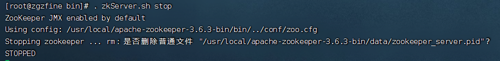
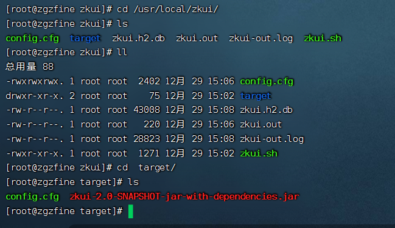
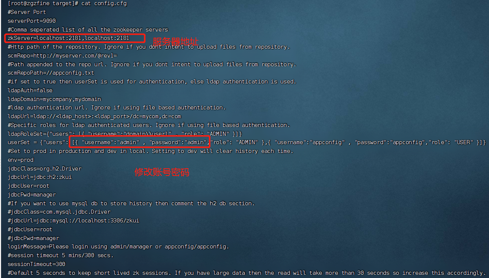

1、zookeeper的下载  
官网 [下载地址](https://zookeeper.apache.org/releases.html)

>  wget --no-check-certificate https://dlcdn.apache.org/zookeeper/zookeeper-3.6.3/apache-zookeeper-3.6.3-bin.tar.gz
> 

2、解压压缩包
>tar -zxvf apache-zookeeper-3.6.3-bin.tar.gz -C /usr/local/

3、进入zookeeper的安装目录下
* 创建data目录，存放我们的数据，使用以下命令
> cd /usr/local/apache-zookeeper-3.6.3-bin
> mkdir data
> 

4、进入conf目录，修改文件名称
* 把zoo_sample.cfg 改名为zoo.cfg。可以复制一份，重命名为zoo.cfg（默认配置名称）
> #进入conf目录
> cd conf/
> #复制一份，名为zoo.cfg
> cp zoo_sample.cfg zoo.cfg

5、修改zoo.cfg配置文件
* 将dataDir修改为我们自己创建的data目录


6、启动测试
* 进入zookeeper目录下的bin目录,使用命令启动zkServer.sh,后缀为sh的为linux启动，为cmd的是Windows下启动
> ./zkServer.sh start

* 启动后查看服务的状态，显示如下信息则启动成功
> ./zkServer.sh status


* 停止服务
> ./zkServer.sh stop


7、zkui的安装  
7.1 下载 [zkui](https://github.com/DeemOpen/zkui)

7.2 编译
> mvn clean package  

7.3 上传到服务器
> rz


7.4 修改配置


7.5 上传启动脚本
```
#!/usr/bin/env bash

PIDFILE=~/zkui.pid
ZKUIBINDIR=$(cd `dirname $0`; pwd)
ZKUICLASSNAME="target/zkui-2.0-SNAPSHOT-jar-with-dependencies.jar"
ZKUI_DAEMON_OUT=$ZKUIBINDIR/zkui.out

start(){
    echo  "Starting zkui ... $ZKUIBINDIR"
    if [ -f "$PIDFILE" ]; then
        if kill -0 `cat "$PIDFILE"` > /dev/null 2>&1; then
            echo zkui already running as process `cat "$PIDFILE"`. 
            exit 0
        fi
    fi
    cd $ZKUIBINDIR
    cp config.cfg target
    nohup java -jar "$ZKUIBINDIR/$ZKUICLASSNAME" > "$ZKUI_DAEMON_OUT" 2>&1 < /dev/null &
    if [ $? -eq 0 ];
    then
        echo $!>$PIDFILE
        if [ $? -eq 0 ];
        then
            sleep 1
            echo STARTED
        else
            echo FAILED TO WRITE PID
            exit 1
        fi
    else
        echo SERVER DID NOT START
        exit 1
    fi
}

stop(){
    echo -n "Stopping zkui ... "
    if [ ! -f "$PIDFILE" ]
    then
        echo "no zkui to stop (could not find file $PIDFILE)"
    else
        kill -9 $(cat "$PIDFILE")
        rm "$PIDFILE"
        echo STOPPED
    fi
    exit 0
}

case "$1" in
start)
    start
    ;;
stop)
    stop
    ;;
restart)
    shift
    "$0" stop
    sleep 3
    "$0" start
    ;;
*)
    echo "Usage: $0 {start|stop|restart}" >&2
esac

```