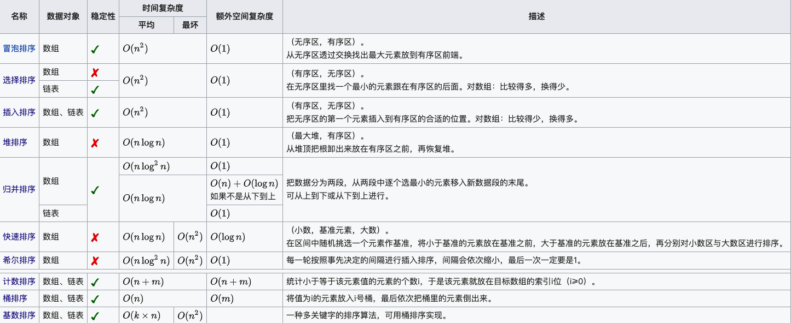

> 排序算法是每个开发都必须要熟练掌握，是研究算法题的开端

排序算法可以分为内部排序和外部排序，内部排序是数据记录在内存中进行排序，而外部排序是因排序的数据很大，一次不能容纳全部的排序记录，在排序过程中需要访问外存。常见的内部排序算法有：插入排序、希尔排序、选择排序、冒泡排序、归并排序、快速排序、堆排序、基数排序等。

排序算法总览：

<!--more-->

# 关于时间复杂度

平方阶 (O(n2)) 排序 各类简单排序：直接插入、直接选择和冒泡排序。  
线性对数阶 (O(nlog2n)) 排序 快速排序、堆排序和归并排序；  
O(n1+§)) 排序，§ 是介于 0 和 1 之间的常数。 希尔排序  
线性阶 (O(n)) 排序 基数排序，此外还有桶、箱排序。

# 关于稳定性

稳定的排序算法：冒泡排序、插入排序、归并排序和基数排序。  
不是稳定的排序算法：选择排序、快速排序、希尔排序、堆排序。

名词解释：

* n：数据规模
* k："桶"的个数
* In-place：占用常数内存，不占用额外内存
* Out-place：占用额外内存
* 稳定性：排序后 2 个相等键值的顺序和排序之前它们的顺序相同

---

# 1、冒泡排序

## 1.1 算法步骤

比较相邻的元素。如果第一个比第二个大，就交换他们两个。  
对每一对相邻元素作同样的工作，从开始第一对到结尾的最后一对。这步做完后，最后的元素会是最大的数。  
针对所有的元素重复以上的步骤，除了最后一个。  
持续每次对越来越少的元素重复上面的步骤，直到没有任何一对数字需要比较。

## 1.2 动图演示

## 2.3 什么时候最快

当输入的数据已经是正序时（都已经是正序了，我还要你冒泡排序有何用啊）。

## 2.4 什么时候最慢

当输入的数据是反序时

## 2.5 实现

~~~
public class BubbleSort implements IArraySort {

    @Override
    public int[] sort(int[] sourceArray) throws Exception {
        // 对 arr 进行拷贝，不改变参数内容
        int[] arr = Arrays.copyOf(sourceArray, sourceArray.length);

        for (int i = 1; i < arr.length; i++) {
            // 设定一个标记，若为true，则表示此次循环没有进行交换，也就是待排序列已经有序，排序已经完成。
            // 这里是冒泡排序的优化项
            boolean flag = true;

            for (int j = 0; j < arr.length - i; j++) {
                if (arr[j] > arr[j + 1]) {
                    int tmp = arr[j];
                    arr[j] = arr[j + 1];
                    arr[j + 1] = tmp;

                    flag = false;
                }
            }

            if (flag) {
                break;
            }
        }
        return arr;
    }
}
~~~

---

# 2、选择排序

选择排序是一种简单直观的排序算法，无论什么数据进去都是 O(n²) 的时间复杂度。所以用到它的时候，数据规模越小越好。唯一的好处可能就是不占用额外的内存空间了吧。

## 2.1 算法步骤

首先在未排序序列中找到最小（大）元素，存放到排序序列的起始位置。  
再从剩余未排序元素中继续寻找最小（大）元素，然后放到已排序序列的末尾。  
重复第二步，直到所有元素均排序完毕。

## 2.2 动图演示

## 2.3 实现

~~~
public class SelectionSort implements IArraySort {

    @Override
    public int[] sort(int[] sourceArray) throws Exception {
        int[] arr = Arrays.copyOf(sourceArray, sourceArray.length);

        // 总共要经过 N-1 轮比较
        for (int i = 0; i < arr.length - 1; i++) {
            int min = i;

            // 每轮需要比较的次数 N-i
            for (int j = i + 1; j < arr.length; j++) {
                if (arr[j] < arr[min]) {
                    // 记录目前能找到的最小值元素的下标
                    min = j;
                }
            }

            // 将找到的最小值和i位置所在的值进行交换
            if (i != min) {
                int tmp = arr[i];
                arr[i] = arr[min];
                arr[min] = tmp;
            }

        }
        return arr;
    }
}
~~~

---

# 3、 插入排序

插入排序的代码实现虽然没有冒泡排序和选择排序那么简单粗暴，但它的原理应该是最容易理解的了，因为只要打过扑克牌的人都应该能够秒懂。插入排序是一种最简单直观的排序算法，它的工作原理是通过构建有序序列，对于未排序数据，在已排序序列中从后向前扫描，找到相应位置并插入。  
插入排序和冒泡排序一样，也有一种优化算法，叫做拆半插入。

## 3.1 算法步骤

将第一待排序序列第一个元素看做一个有序序列，把第二个元素到最后一个元素当成是未排序序列。  
从头到尾依次扫描未排序序列，将扫描到的每个元素插入有序序列的适当位置。（如果待插入的元素与有序序列中的某个元素相等，则将待插入元素插入到相等元素的后面。）

## 3.2 动图演示

## 3.3 实现

~~~
public class InsertSort implements IArraySort {

    @Override
    public int[] sort(int[] sourceArray) throws Exception {
        // 对 arr 进行拷贝，不改变参数内容
        int[] arr = Arrays.copyOf(sourceArray, sourceArray.length);

        // 从下标为1的元素开始选择合适的位置插入，因为下标为0的只有一个元素，默认是有序的
        for (int i = 1; i < arr.length; i++) {

            // 记录要插入的数据
            int tmp = arr[i];

            // 从已经排序的序列最右边的开始比较，找到比其小的数
            int j = i;
            while (j > 0 && tmp < arr[j - 1]) {
                arr[j] = arr[j - 1];
                j--;
            }

            // 存在比其小的数，插入
            if (j != i) {
                arr[j] = tmp;
            }

        }
        return arr;
    }
}
~~~

# 4、希尔排序

希尔排序，也称递减增量排序算法，是插入排序的一种更高效的改进版本。但希尔排序是非稳定排序算法。
希尔排序是基于插入排序的以下两点性质而提出改进方法的：

* 插入排序在对几乎已经排好序的数据操作时，效率高，即可以达到线性排序的效率；
* 但插入排序一般来说是低效的，因为插入排序每次只能将数据移动一位；

希尔排序的基本思想是：先将整个待排序的记录序列分割成为若干子序列分别进行直接插入排序，待整个序列中的记录"基本有序"时，再对全体记录进行依次直接插入排序。

## 4.1 算法步骤

选择一个增量序列 t1，t2，……，tk，其中 ti > tj, tk = 1；  
按增量序列个数 k，对序列进行 k 趟排序；  
每趟排序，根据对应的增量 ti，将待排序列分割成若干长度为 m 的子序列，分别对各子表进行直接插入排序。仅增量因子为 1 时，整个序列作为一个表来处理，表长度即为整个序列的长度。

## 4.2 动图演示

## 4.3 实现

~~~
public static void shellSort(int[] arr) {
    int length = arr.length;
    int temp;
    for (int step = length / 2; step >= 1; step /= 2) {
        for (int i = step; i < length; i++) {
            temp = arr[i];
            int j = i - step;
            while (j >= 0 && arr[j] > temp) {
                arr[j + step] = arr[j];
                j -= step;
            }
            arr[j + step] = temp;
        }
    }
}
~~~

# 5、归并排序

归并排序（Merge sort）是建立在归并操作上的一种有效的排序算法。该算法是采用分治法（Divide and Conquer）的一个非常典型的应用。  
作为一种典型的分而治之思想的算法应用，归并排序的实现由两种方法：

* 自上而下的递归（所有递归的方法都可以用迭代重写，所以就有了第 2 种方法）；
* 自下而上的迭代；

在《数据结构与算法 JavaScript 描述》中，作者给出了自下而上的迭代方法。但是对于递归法，作者却认为：

> However, it is not possible to do so in JavaScript, as the recursion goes too deep for the language to handle.
> 然而，在 JavaScript 中这种方式不太可行，因为这个算法的递归深度对它来讲太深了。

说实话，我不太理解这句话。意思是 JavaScript 编译器内存太小，递归太深容易造成内存溢出吗？还望有大神能够指教。
和选择排序一样，归并排序的性能不受输入数据的影响，但表现比选择排序好的多，因为始终都是 O(nlogn) 的时间复杂度。代价是需要额外的内存空间。

## 5.1 算法步骤

* 申请空间，使其大小为两个已经排序序列之和，该空间用来存放合并后的序列；
* 设定两个指针，最初位置分别为两个已经排序序列的起始位置；
* 比较两个指针所指向的元素，选择相对小的元素放入到合并空间，并移动指针到下一位置；
* 重复步骤 3 直到某一指针达到序列尾；
* 将另一序列剩下的所有元素直接复制到合并序列尾。

## 5.2 动图演示

## 5.3 实现

~~~
public class MergeSort implements IArraySort {

    @Override
    public int[] sort(int[] sourceArray) throws Exception {
        // 对 arr 进行拷贝，不改变参数内容
        int[] arr = Arrays.copyOf(sourceArray, sourceArray.length);

        if (arr.length < 2) {
            return arr;
        }
        int middle = (int) Math.floor(arr.length / 2);

        int[] left = Arrays.copyOfRange(arr, 0, middle);
        int[] right = Arrays.copyOfRange(arr, middle, arr.length);

        return merge(sort(left), sort(right));
    }

    protected int[] merge(int[] left, int[] right) {
        int[] result = new int[left.length + right.length];
        int i = 0;
        while (left.length > 0 && right.length > 0) {
            if (left[0] <= right[0]) {
                result[i++] = left[0];
                left = Arrays.copyOfRange(left, 1, left.length);
            } else {
                result[i++] = right[0];
                right = Arrays.copyOfRange(right, 1, right.length);
            }
        }

        while (left.length > 0) {
            result[i++] = left[0];
            left = Arrays.copyOfRange(left, 1, left.length);
        }

        while (right.length > 0) {
            result[i++] = right[0];
            right = Arrays.copyOfRange(right, 1, right.length);
        }

        return result;
    }

}
~~~

# 6、快速排序

快速排序是由东尼·霍尔所发展的一种排序算法。在平均状况下，排序 n 个项目要 Ο(nlogn) 次比较。在最坏状况下则需要 Ο(n2) 次比较，但这种状况并不常见。事实上，快速排序通常明显比其他 Ο(nlogn)
算法更快，因为它的内部循环（inner loop）可以在大部分的架构上很有效率地被实现出来。

快速排序使用分治法（Divide and conquer）策略来把一个串行（list）分为两个子串行（sub-lists）。

快速排序又是一种分而治之思想在排序算法上的典型应用。本质上来看，快速排序应该算是在冒泡排序基础上的递归分治法。

快速排序的名字起的是简单粗暴，因为一听到这个名字你就知道它存在的意义，就是快，而且效率高！它是处理大数据最快的排序算法之一了。虽然 Worst Case 的时间复杂度达到了 O(n²)，但是人家就是优秀，在大多数情况下都比平均时间复杂度为
O(n logn) 的排序算法表现要更好，可是这是为什么呢，我也不知道。好在我的强迫症又犯了，查了 N 多资料终于在《算法艺术与信息学竞赛》上找到了满意的答案：

> 快速排序的最坏运行情况是 O(n²)，比如说顺序数列的快排。但它的平摊期望时间是 O(nlogn)，且 O(nlogn) 记号中隐含的常数因子很小，比复杂度稳定等于 O(nlogn) 的归并排序要小很多。所以，对绝大多数顺序性较弱的随机数列而言，快速排序总是优于归并排序。

## 6.1 算法步骤
* 从数列中挑出一个元素，称为 "基准"（pivot）;   
* 重新排序数列，所有元素比基准值小的摆放在基准前面，所有元素比基准值大的摆在基准的后面（相同的数可以到任一边）。在这个分区退出之后，该基准就处于数列的中间位置。这个称为分区（partition）操作；  
* 递归地（recursive）把小于基准值元素的子数列和大于基准值元素的子数列排序；

## 6.2 动图演示

## 6.3 实现
~~~
public class QuickSort implements IArraySort {

    @Override
    public int[] sort(int[] sourceArray) throws Exception {
        // 对 arr 进行拷贝，不改变参数内容
        int[] arr = Arrays.copyOf(sourceArray, sourceArray.length);

        return quickSort(arr, 0, arr.length - 1);
    }

    private int[] quickSort(int[] arr, int left, int right) {
        if (left < right) {
            int partitionIndex = partition(arr, left, right);
            quickSort(arr, left, partitionIndex - 1);
            quickSort(arr, partitionIndex + 1, right);
        }
        return arr;
    }

    private int partition(int[] arr, int left, int right) {
        // 设定基准值（pivot）
        int pivot = left;
        int index = pivot + 1;
        for (int i = index; i <= right; i++) {
            if (arr[i] < arr[pivot]) {
                swap(arr, i, index);
                index++;
            }
        }
        swap(arr, pivot, index - 1);
        return index - 1;
    }

    private void swap(int[] arr, int i, int j) {
        int temp = arr[i];
        arr[i] = arr[j];
        arr[j] = temp;
    }

}
~~~

